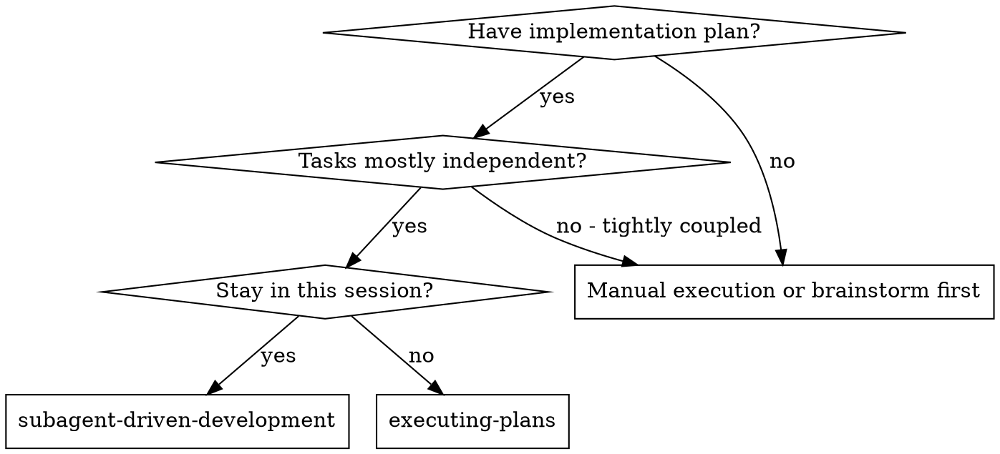

# Subagent-Driven Development

Execute a plan by dispatching a fresh implementer subagent per task, a task review (spec compliance + code quality) after each, and a broad whole-branch review at the end. The plan, ledger, briefs, and reports live in workspace state — the database is the record.

**Why subagents:** You delegate tasks to specialized agents with isolated context. By precisely crafting their instructions and context, you ensure they stay focused and succeed at their task. They should never inherit your session's context or history — you construct exactly what they need. This also preserves your own context for coordination work.

**Core principle:** Fresh subagent per task + task review (spec + quality) + broad final review = high quality, fast iteration.

**Models:** Every child inherits the configured default model. There is no model selection — never choose, request, or mention models when dispatching.

**Narration:** between tool calls, narrate at most one short line — the ledger and the tool results carry the record.

**Continuous execution:** Do not pause to check in with your human partner between tasks. Execute all tasks from the plan without stopping. The only reasons to stop are the four named below, or all tasks complete. "Should I continue?" prompts and progress summaries waste their time — they asked you to execute the plan, so execute it.

**Rulings, not stalls.** A running plan does not wait on a human. Conflicts, ambiguities, plan defects, a cap you would have asked to exceed — decide them. The spec is the binding authority, the plan is its argument, and your judgment settles what neither answers. Record every decision in the ledger as `Ruling: <what you decided> — <why> — <what it costs if wrong>`, and keep going. A wrong ruling costs rework your human partner can see and undo; a session parked on a question costs their whole day and buys nothing.

Four things stop you, and only these: an irreversible or destructive operation; a security-sensitive action; a side effect outside this worktree that norms say you ask about first (a merge, a push to a shared branch, a publish); and a plan so broken that every path forward is a guess. For those, stop and ask.

## When to Use



**vs. Executing Plans (separate session):**
- Same session (no context switch)
- Fresh subagent per task (no context pollution)
- Review after each task (spec compliance + code quality), broad review at the end
- Faster iteration (no human-in-loop between tasks)

## Setup

Ensure work happens in an isolated workspace: use using-git-worktrees to create
one or verify the existing one. Never start implementation on a main/master
branch without your human partner's explicit consent.

Conversation memory does not survive compaction. In real sessions, controllers
that lost their place have re-dispatched entire completed task sequences — the
single most expensive failure observed. Track progress in the ledger, not only
in todos.

- Each plan owns a state namespace: `sdd.<plan-slug>` where `<plan-slug>` is
  the plan key's basename (plan key `plans/2026-08-24-native-skills-db-planning`
  → namespace `sdd.native-skills-db-planning`). Home to the ledger
  (`sdd.<slug>/ledger`), per-task briefs (`sdd.<slug>/task-N-brief`), and
  reports (`sdd.<slug>/task-N-report`). Another plan's keys are never yours to
  read or write.
- Check for this plan's ledger with `state.get sdd.<slug>/ledger`. If its first
  line names your plan key, tasks with a `Task <N>: complete` line are DONE —
  do not re-dispatch them; resume at the first task without one. A task whose
  last line is a fix round is mid-loop: resume the loop at the next round. A
  ledger naming a different plan belongs to another run: leave it alone.
- Create the ledger with its identity as the first line:
  `# SDD ledger — plan: <plan key>`.
- The ledger is your recovery map: the commits it names exist in git even when
  your context no longer remembers creating them. After compaction, trust the
  ledger and `git log` over your own recollection. Append ledger lines with `state.append` (key `sdd.<slug>/ledger`, text one
  line). It is CAS by design: pass `expectedVersion=<n>` when resuming after a
  conflict report; on VersionConflict re-get, reconcile, retry — never
  blind-overwrite. For bulk scratch cleanup at Finish use
  `state.prune` on the plan's task namespace (dotted boundary
  respected), keeping the ledger itself.

Read the plan once (`state.get <plan-key>`), note its context and Global
Constraints, and create a todo per task. If the plan names a Spec (a
`specs/<date>-<topic>` key), read that too: the spec is the authority the plan
argues from, and conflicts inside the plan resolve against it. A plan with no
reachable spec gets a ledger note saying so — rulings made without one are
provisional.

Before dispatching Task 1, scan the plan once for conflicts, writing down what
you checked as you check it:

- tasks that contradict each other or the plan's Global Constraints
- anything the plan explicitly mandates that the review rubric treats as a defect

The scan's output is a table in the ledger, not a verdict: one row for every
pair of tasks sharing a file or interface, one row per task for self-consistency
(tests vs code, files created vs files touched). Rule on each conflict — spec as
binding authority — record the ruling beside its row, then dispatch Task 1. If
the scan is clean, say so in the ledger and proceed. The review loop remains the
net for conflicts that emerge only from implementation.

## The Task Loop

**Batch small same-shape work.** When the plan lists several tasks that are each
a small, independent edit of the same kind, compose ONE dispatch covering the
batch and review its diff as one unit. Reserve one-dispatch-per-task for work
needing its own judgment, tests, or review surface.

Everything a child returns stays resident in your context for the rest of the
session. Hand artifacts over through state keys; children read what they need
with `state.get`.

**Waiting on dispatched children:** spawn returns immediately with an id — it
does not block. While children run, keep doing local work (ledger updates,
composing the next brief). When genuinely idle, wait in bounded stretches and
between stretches post one status line and reconcile live children with
`status`; chase any that finished without reporting. `Error [ConcurrencyCapReached]`
from spawn means retrieve pending results before spawning more.

### 1. Dispatch the implementer

Record BASE (`git rev-parse HEAD`) before dispatching — fix-round diffs need it.

- **Brief:** write the task's full text to `sdd.<slug>/task-N-brief` via
  `state.set` BEFORE dispatching. It is the single source of requirements, with
  exact values verbatim. Your spawn prompt contains: (1) one line on where this
  task fits; (2) the brief's KEY PATH, introduced as "retrieve your requirements
  with `state.get sdd.<slug>/task-N-brief` — exact values are there, use them
  verbatim"; (3) interfaces and decisions from earlier tasks the brief cannot
  know; (4) your resolution of any ambiguity you noticed; (5) the report key and
  the report contract. Never paste the brief content into the dispatch, and
  never make a child read the whole plan.
- **Report:** the implementer writes its full report to
  `sdd.<slug>/task-N-report` via `state.set` and returns ONLY: status (DONE /
  DONE_WITH_CONCERNS / NEEDS_CONTEXT / BLOCKED), commits, a one-line test
  summary, concerns.
- A dispatch describes one task, not the session's history. Do not paste
  accumulated prior-task summaries into later dispatches. A fresh child needs
  its task, the interfaces it touches, and the global constraints. Nothing else.
- The dispatch carries the no-subagents contract (it is in the implementer
  template): the implementer never spawns subagents — not helpers, and never a
  reviewer. Review arrives from you, after the report.
- If an earlier task parked a finding in this task's area, carry a pointer to
  that ledger entry in the dispatch.
- Record the child's agent id from the spawn result — fix rounds 1–3 resume it.
- Never dispatch multiple implementation children in parallel (conflicts).

Template: Implementer Dispatch Template below.

### 2. Handle the report

Read the report from state (`state.get sdd.<slug>/task-N-report`) plus the short
contract the child returned. Statuses:

**DONE:** go to review.

**DONE_WITH_CONCERNS:** read the concerns. Correctness/scope concerns are
addressed before review; observations are noted and review proceeds.

**NEEDS_CONTEXT:** provide the missing context and re-dispatch.

**BLOCKED:** assess. Context problem → more context, same child. Needs deeper
reasoning → fresh child (rounds 4–5 route). Too large → split the task. Plan
wrong → rule, ledger the ruling, re-dispatch carrying the ruling. Never ignore
an escalation or force a retry without changes.

If the implementer asks questions — before starting or mid-task — answer clearly
and completely, and don't rush it into implementation.

### 3. Review the task

Per-task reviews are task-scoped gates; the broad review happens once, at the
end. Never skip it, and never accept a report missing either verdict — spec
compliance AND task quality are both required. Implementer self-review never
replaces the task review.

- **The reviewer runs the diff itself.** Give the reviewer child the BASE and
  HEAD commit ids; it produces the commit list, stat, and full diff in its own
  session via exec (`git log --oneline BASE..HEAD`, `git diff --stat BASE HEAD`,
  `git diff -U10 BASE HEAD`). The diff never enters YOUR context. Use the BASE
  recorded before dispatching — never `HEAD~1`, which silently truncates
  multi-commit tasks.
- **Reviewer inputs:** the brief key, the report key (both retrieved via
  `state.get`), BASE and HEAD ids, and the global constraints verbatim from the
  plan. The constraints block is the reviewer's attention lens — exact values,
  formats, stated relationships ("same layout as X", "matches Y"). Its template
  already carries process rules; yours carries THIS project's demands.
- Do not add open-ended directives ("check all uses") without a concrete
  task-specific reason.
- Do not ask a reviewer to re-run tests the implementer already ran on the same
  code — the report carries the test evidence.
- Do not pre-judge findings. Never instruct a reviewer to ignore or not flag an
  issue. If you believe a finding is false, let the reviewer raise it and
  adjudicate in the loop. If your prompt contains "do not flag," "don't treat X
  as a defect," "at most Minor," or "the plan chose" — stop: you are
  pre-judging.

The reviewer may report "⚠️ Cannot verify from diff" items. These do not block
its other verdicts, but YOU must resolve each before marking the task complete —
you hold the plan and cross-task context. A confirmed gap is a failed spec
review: it enters the fix loop.

Template: Task Reviewer Template below.

### 4. The fix loop

Triggers on spec ❌, any Critical or Important finding, or a ⚠️ item you
confirmed as real.

Two things leave the loop immediately:

- Record Minor findings in the ledger as you go
  (`Task <N>: minor (deferred): <one-liner>`); the final whole-branch review
  triages that list. Minor findings never enter the loop.
- A finding labeled plan-mandated — or conflicting with plan text — is yours to
  rule on: weigh it against plan text, decide with the spec as binding authority,
  ledger the ruling before acting. Do not dismiss because the plan mandates it;
  do not dispatch a contradicting fix without a recorded ruling.

Everything else enters the loop. A fix round is one fix dispatch plus one scoped
re-review. Five rounds maximum:

**Rounds 1–3 — resume the original implementer.** Send it the open findings
verbatim (same agent id; use the harness's resume path). Its context is intact.
If your harness cannot resume a live child, dispatch a FRESH implementer
carrying the brief key, report key, and findings — the report key is the
persistent memory either way. Fresh eyes, same default model.

**Rounds 4–5 — dispatch a FRESH implementer.** Same brief key, report key, open
findings, framing: "A prior implementer attempted this task N times; you own it
now. Read the report with `state.get` for what was tried." A loop surviving
three resumes usually means the implementer cannot see its own problem — fresh
eyes in one move.

**Every round, either way:** the implementer fixes, re-runs the tests covering
the amended code, APPENDS its fix report to the same report key (CAS append),
and returns the short contract. Before re-review, confirm the fix report holds
the covering tests, the command run, and the output. Name the covering test
files in the fix message — a one-line fix does not need the whole suite.

**The re-review is scoped.** New FIX_BASE = the head the previous review saw.
The re-reviewer gets the findings list, brief key, report key, and FIX_BASE +
new HEAD; it diffs the fix range itself. Verdicts each finding ADDRESSED or NOT
ADDRESSED; flags new breakage in the fix diff only. New Critical/Important
breakage joins the open list. Out-of-scope observations go to the ledger as
deferred minors — they never extend the loop.

**After each round,** append to the ledger:
`Task <N>: fix round <R>/5 (<X> addressed, <Y> open — <one-liners>; commits <a7>..<b7>)`

Never fix findings yourself in the controller session — your context stays clean
for coordination, and controller fixes skip review.

**The breaker.** When round 5's re-review still leaves findings open, stop
dispatching. Adjudicate each open finding yourself:

- **Reviewer wrong, or contestable:** park it —
  `Task <N>: parked — <finding> — Ruling: <why the code stands>`.
- **Real, nothing downstream builds on it:** park with a ruling saying so.
- **Real and load-bearing:** rule on the smallest change that unblocks dependent
  work, ledger it as `Task <N>: Ruling: <finding> — <decision and why>`, carry
  into the next dispatch. Stop only when the defect leaves every path forward a
  guess.

Adjudicate only at the cap. Adjudicating earlier to end a loop is pre-judging
with a different name. Every adjudication is a ledger entry — silent discards
are forbidden.

### 5. Complete the task

When review comes back clean — or every open finding is parked-with-ruling at
the cap — append the completion line:

- `Task <N>: complete (commits <base7>..<head7>, review clean)`
- `Task <N>: complete (commits <base7>..<head7>, <K> parked)` after a breaker

Then mark the todo complete and move on. Never advance while open
Critical/Important findings are neither fixed nor parked-with-ruling at the cap.

## Final Review

The final whole-branch review gets MERGE_BASE (e.g. `git merge-base main HEAD`)
and HEAD; it runs the branch diff itself via exec. Dispatch using
requesting-code-review's flow. Point it at the ledger's deferred-minor and
parked lines so it can triage which must be fixed before merge.

If final review returns findings, dispatch ONE fix child with the complete list
— not one fixer per finding. Per-finding fixers rebuild context and re-run
suites; a real session's final-review fix wave cost more than all its tasks.
Then exactly one scoped re-review of the fix wave. Adjudicate residuals like the
task-loop breaker: park with rulings, or rule on load-bearing ones. Only the
four classes stop you here. There is no second fix wave — residual load-bearing
findings surface to your human partner when finishing-a-development-branch
presents options.

## Finish

Before deleting anything, collect every ledger line containing `Ruling:` —
preflight rulings, parked findings, breaker adjudications, all of them — into
your final message under "Rulings I made", in order, each with what it costs if
wrong. That list is the only place decisions taken on your human partner's
behalf reach them. A ruling that dies with the session was made in secret.

When final review is clean and fixes merged, delete this plan's scratch keys
(`state.delete sdd.<slug>/task-N-brief` and `-report` for each task) — the
ledger itself stays; git history is the code record. Sibling namespaces belong
to other plans; leave them alone.

Use finishing-a-development-branch.

## Common Rationalizations

| Excuse | Reality |
|--------|---------|
| "Close enough on spec compliance" | Reviewer found spec gaps = not done. Fix or hit the cap and adjudicate — those are the only exits. |
| "I'll fix it myself, dispatching is overhead" | Controller fixes pollute your context and skip review. Resume the implementer. |
| "One more round will converge" | Past the cap, rounds don't converge — the failure is structural. Adjudicate and route. |
| "The reviewer will just find something new anyway" | Scoped re-reviews verify fixes; they cannot wander. New findings on untouched code go to the ledger, not the loop. |
| "This finding is obviously wrong, I'll drop it" | You adjudicate only at the cap, and every ruling is a ledger entry. Silent discards are forbidden. |
| "The fix was small, skip the re-review" | Unreviewed fixes are how regressions land. Every round ends with a scoped re-review. |
| "Reviews slow the loop down" | The loop without reviews is just unverified churn. Reviews are the loop's brakes and steering. |
| "Ledger bookkeeping is overhead" | The ledger is what survives compaction. Controllers without one have re-dispatched entire completed task sequences. |
| "The implementer spawned its own reviewer — free extra assurance" | It's a duplicate seat reviewing the same diff; the task review is the gate. A worker-spawned reviewer is a defect to flag, not rigor. |
| "I'll pick a stronger model for the stuck rounds" | Model selection does not exist here. Children inherit the default model; escalation is FRESH EYES, never a model tier. |

## Example Workflow

```text
You: I'm using Subagent-Driven Development to execute this plan.

[Setup: worktree verified]
[state.get plans/<plan-key> once; note Global Constraints]
[state.get sdd.<slug>/ledger — none; create with identity line]
[Pre-flight scan table written to ledger]
[Create todos for all tasks]

Task 1: Hook installation script

[state.set sdd.<slug>/task-1-brief = task text]
[spawn implementer: brief key + report key + context]

Implementer asks: "should the hook be user or system level?"
You: "User level."
Implementer: DONE — commits a1b2c3d..d4e5f6a, 5/5 tests pass
[state.get sdd.<slug>/task-1-report — full report read here, once]

[spawn task reviewer: brief key + report key + BASE e58ee6f + HEAD d4e5f6a]
Reviewer: Spec ✅. Quality approved. No findings.

[Ledger CAS append: Task 1: complete (commits e58ee6f..d4e5f6a, review clean)]

Task 2: Recovery modes
... same shape ...

Implementer reports Spec ❌ risk: reviewer finds missing progress reporting + magic number
[Fix round 1: resume implementer with both findings]
Implementer: fixed, appended fix report to task-2-report, 10/10 passing
[Re-review: FIX_BASE d4e5f6a .. new HEAD b7c8d9e]
Re-reviewer: both ADDRESSED, no new breakage.

[Ledger: Task 2: fix round 1/5 (2 addressed, 0 open; commits d4e5f6a..b7c8d9e)]
[Ledger: Task 2: complete (commits d4e5f6a..b7c8d9e, review clean)]

[After all tasks]
[spawn final reviewer: MERGE_BASE + HEAD + deferred-minors list]
Final reviewer: all requirements met; deferred minors triaged, none block merge.

[Delete task brief/report keys — ledger stays]
Done! Using finishing-a-development-branch.
```

## Implementer Dispatch Template

Fill every bracket; delete none. The bracketed values are paths into state, not
content to paste.

```text
You are implementing ONE task of a larger plan. You have no access to the plan
or session history except what is below and what you retrieve yourself.

Where this fits: <one line>

Your requirements: retrieve them FIRST with
  state.get key="sdd.<slug>/task-N-brief"
That brief is authoritative — exact values, signatures, and test cases appear
only there; use them verbatim. Do not ask others for the plan file.

Interfaces from earlier tasks you will build on:
<exact names/signatures, or "none">

Ambiguity resolutions: <rulings you already made, or "none">

Write your FULL report — what you did, files touched, test commands with
output summaries, self-review notes — to
  state.set key="sdd.<slug>/task-N-report" value=<full report>
Appending later fix rounds goes to the SAME key with CAS.

Return ONLY this contract, nothing else:
STATUS: DONE | DONE_WITH_CONCERNS | NEEDS_CONTEXT | BLOCKED
COMMITS: <list>
TESTS: <one line>
CONCERNS: <none, or one line each>

Rules:
- Commit your work with the git_commit tool following the session's active commit-style guidance (bootstrap section); never raw shell commits.
- Tests run via dotnet CLI. Every change leaves the suite green.
- NEVER spawn subagents — not helpers, not reviewers. Review arrives from the
  controller after your report.
- If blocked, say BLOCKED and why; do not guess past blockers.
```

## Task Reviewer Template

```text
You are reviewing ONE completed task of a larger plan. You did not write this
code; judge it cold.

Retrieve, in order:
  state.get key="<brief key>"     — the requirements
  state.get key="<report key>"    — the implementer's claims

Produce the diff YOURSELF in this session via exec:
  git log --oneline <BASE>..<HEAD>
  git diff --stat <BASE> <HEAD>
  git diff -U10 <BASE> <HEAD>
Do not trust the report's description of the diff; verify against it.

Global constraints binding this task (verbatim from the plan):
<pasted constraint lines>

Review for BOTH, with separate verdicts:
1. SPEC COMPLIANCE ✅/❌ — every brief requirement present; nothing extra.
   List anything missing, extra, or diverging from exact values.
2. TASK QUALITY — approve, or findings rated Critical / Important / Minor.
   Judge correctness, test honesty (do tests assert the behavior?), and fit
   with surrounding code.

You may mark items "⚠️ Cannot verify from diff" — the controller resolves those.

Return: both verdicts, findings as a numbered list with severity + file:line,
and any ⚠️ items. No praise padding.
```

## Re-Review Template

```text
You are verifying FIXES only. Prior review found these findings:
<numbered findings, verbatim>

Retrieve context:
  state.get key="<brief key>"
  state.get key="<report key>"   — includes the fix report appended by the implementer

Diff the fix range YOURSELF via exec:
  git diff -U10 <FIX_BASE> <HEAD>
Judge ONLY this range.

For each finding: ADDRESSED (cite file:line) or NOT ADDRESSED (why).
Flag NEW breakage introduced in the fix diff (Critical/Important/Minor).
Out-of-scope observations belong to the controller, not this verdict.

Return: per-finding verdicts, any new breakage, nothing else.
```
